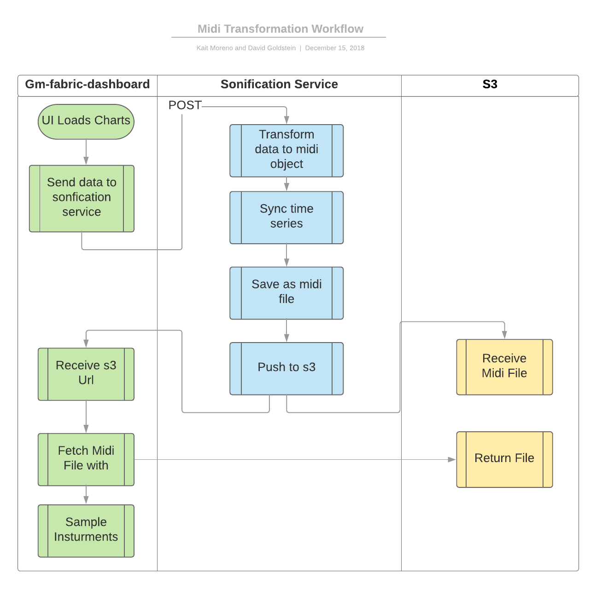

# Midi Sonification Service

Micro service which takes in services metric data as a http request, creates a midi file, uploads it to a data store, and returns the url.

## Workflow

This service is part of the overall workflow for our 'metric sonification' project workflow for the 2018 Decipher Hackathon:



## Prerequisites

You will need 

- [pip](https://pip.pypa.io/en/stable/installing/)
- [virtualenv](https://virtualenv.pypa.io/en/latest/)
- [python 2.7](https://www.python.org/downloads/release/python-2713/)

## Installation and Usage

```sh
# clone the repo
git clone git@github.com:dgoldstein1/MidiSonificationServer.git
# cd inside
cd MidiSonificationServer
# start virtual env
virtualenv env
source env/bin/activate
# install dependencies
pip install -r requirements.txt
# set environment variables for s3
export S3_ACCESS_KEY=your_access_key
export S3_SECRET_ACCESS_KEY=your_secret_key
export S3_BUCKET_NAME=your_bucket_name
export S3_BUCKET_URL=https://s3.amazonaws.com/your_bucket_name
export S3_FOLDER_PATH=path_you_want_midi_to_load_to # optional
# start the server locally on port 3028
python server.py 3028
# test with sample data
./testRequests.sh
# a file should be uploaded to s3. A link should be printed out in the server logs and as a response to the request
```

## Docker 

To launch a docker image locally..

```sh
docker-compose up -d
```

To create a new docker image..

```sh
./build_docker_image.sh
```

## Authors

* **David Goldstein** - [DavidCharlesGoldstein.com](http://www.davidcharlesgoldstein.com/) - [Decipher Technology Studios](http://deciphernow.com/)

See also the list of [contributors](https://github.com/your/project/contributors) who participated in this project.

## License

This project is licensed under the MIT License - see the [license.md](LICENSE) file for details